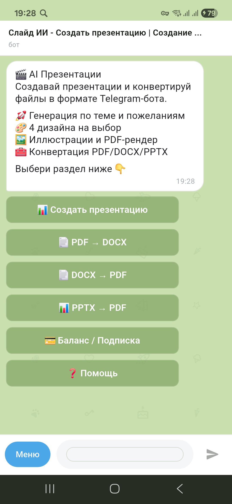
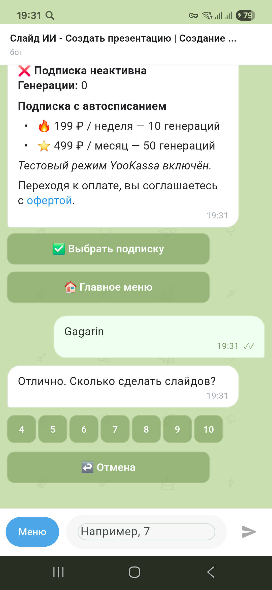
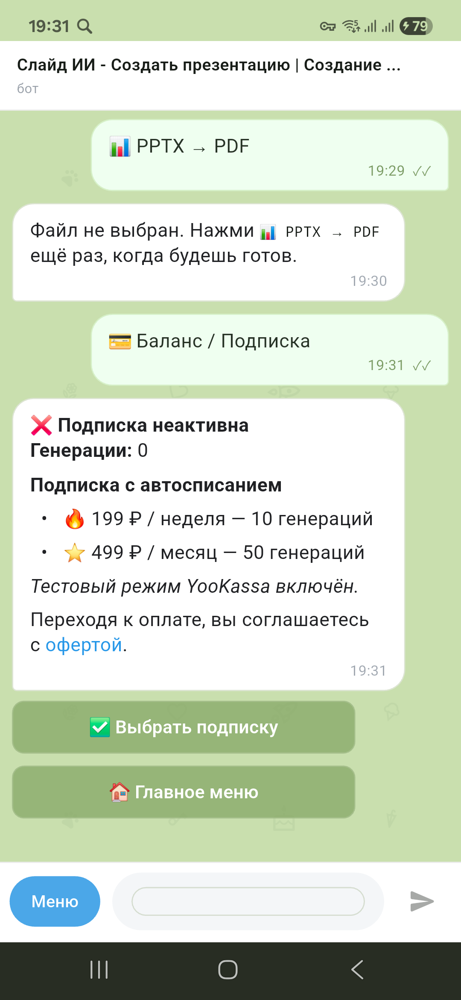

# AppSlides

Мобильное приложение и backend-сервис для создания презентаций в формате чат-бота.

`AppSlides` делает генерацию презентаций простой для обычного пользователя: человек пишет тему, выбирает количество слайдов и стиль, а приложение собирает готовые файлы `PPTX` и `PDF`. Весь сценарий выглядит как диалог в Telegram-боте, но работает внутри отдельного Android-приложения с собственным backend.

## Что умеет проект

- Генерировать презентации по теме и пожеланиям пользователя.
- Предлагать план будущей презентации перед сборкой.
- Давать выбор из нескольких шаблонов оформления.
- Собирать готовые `PPTX` и `PDF`.
- Конвертировать файлы между `PDF`, `DOCX` и `PPTX`.
- Показывать историю переписки прямо в приложении.
- Сохранять историю чата локально на устройстве между перезапусками.
- Работать с оплатой подписки через `YooKassa`.

## Как это выглядит

### Главный экран

### Сценарий создания презентации

### Подписка и YooKassa

## Как это работает

1. Пользователь открывает приложение и попадает в единое окно чата.
2. Нажимает `Создать презентацию` или просто пишет тему текстом.
3. Приложение уточняет количество слайдов и собирает план.
4. Пользователь подтверждает план или редактирует его.
5. Выбирает шаблон оформления.
6. Backend собирает презентацию и возвращает готовые файлы.
7. Файлы можно открыть на устройстве, а история диалога остаётся в приложении.

## Почему формат чата

Вместо сложного интерфейса с вкладками и формами проект специально сделан как чат:

- пользователю проще понимать следующий шаг;
- диалог похож на привычный Telegram-бот;
- в одной ленте видны сообщения, действия, файлы и статусы;
- такой интерфейс хорошо подходит для MVP и быстрых итераций.

## Из чего состоит проект

### `app/`

Flutter-приложение для Android.  
Именно здесь находится интерфейс чата, локальная история, работа с файлами и взаимодействие с backend.

### `backend/`

Python backend на `FastAPI`.  
Он отвечает за генерацию контента, сборку презентаций, конвертацию файлов, оплату через `YooKassa` и выдачу артефактов приложению.

### `telegrambot/`

Исходная рабочая база Telegram-бота, на основе которой проект был перенесён в формат мобильного приложения.

## Текущее состояние

Сейчас проект уже умеет:

- работать как реальное Android-приложение;
- подключаться к удалённому backend на сервере;
- генерировать презентации и собирать файлы;
- показывать и восстанавливать чат после перезапуска приложения;
- работать с подпиской через `YooKassa` в тестовом режиме;
- использовать реальные шаблоны презентаций на backend.

## Для кого это

`AppSlides` подходит для сценариев, где нужно быстро получить аккуратную презентацию без ручной верстки:

- учёба;
- выступления;
- отчёты;
- простые коммерческие презентации;
- быстрые черновики для дальнейшей доработки.

## Что дальше

План развития проекта:

- дальнейшая доводка chat UX;
- улучшение визуального стиля и шаблонов;
- push-уведомления о готовности презентации;
- развитие системы подписок;
- дополнительные шаблоны и сценарии генерации;
- публикация и эксплуатация как полноценного мобильного продукта.

## Статус репозитория

Репозиторий содержит полный рабочий контур:

- Flutter-клиент;
- backend;
- docker-deploy на сервер;
- рабочие шаблоны презентаций;
- документацию по разработке и эксплуатации.

---

Если нужен технический уровень описания, смотри отдельные документы в [app/README.md](app/README.md), [backend/README.md](backend/README.md), [APPSLIDES_PLAN.md](APPSLIDES_PLAN.md) и [OPERATIONS.md](OPERATIONS.md).
